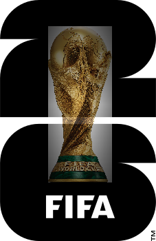
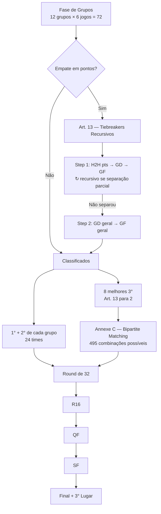
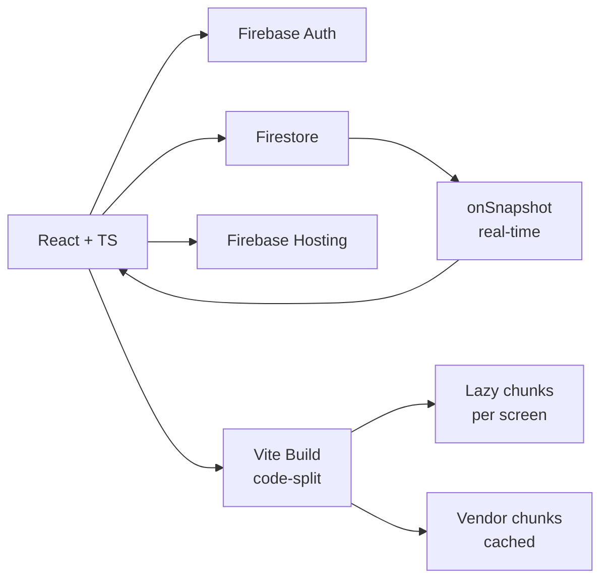

<div align="center">



# Bolão Copa 2026

### _Aposte. Acerte. Domine o ranking._ 🏆⚽

**O bolão da Copa do Mundo 2026 — real-time, mobile-first, profissional.**
Para juntar seus amigos numa só tela e descobrir quem realmente entende de futebol.

<br />

[](https://bolao2026-a76c7.web.app)
[](https://bolao2026-a76c7.web.app/styleguide.html)

<br />


</div>

<br />

> _"Da abertura no Estádio Azteca à final em East Rutherford — você acompanha cada placar, cada surpresa, cada zoeira."_

<br />

---

## ✨ Demo

<div align="center">

<!-- Adicione um GIF de 5-10s aqui mostrando login → dashboard → bet → ranking -->
<!-- Capturar com Kap (Mac) ou ScreenToGif (Windows). Veja docs/screenshots/README.md -->


**▶ Acesse em produção:** [bolao2026-a76c7.web.app](https://bolao2026-a76c7.web.app)

</div>

<br />

---

## 🎯 Por que esse bolão é diferente

<table>
<tr>
<td width="33%" align="center">

### ⚡ Real-time

Ranking atualiza ao vivo via `onSnapshot` do Firestore. Admin lança um resultado → todo participante vê a movimentação em ~2 segundos.

</td>
<td width="33%" align="center">

### 📱 Mobile-first

Desenvolvido primeiro pro celular. Nomes de seleção abreviados (BRA, ARG) no mobile, completos (Brasil, Argentina) no desktop — sem JS.

</td>
<td width="33%" align="center">

### 🏆 FIFA-correct

Lógica oficial Art. 12-14: tiebreakers recursivos, Annexe C com bipartite matching, calendário oficial em horário de Brasília.

</td>
</tr>
</table>

<br />

---

## 🖼️ Telas

<div align="center">

|  |  |
|:---:|:---:|
| <br />**Apostar** — 72 jogos + bracket completo | <br />**Copa** — 12 grupos + chaveamento FIFA |
| <br />**Ranking** — pódio + lista ao vivo | <br />**Admin** — dashboard com KPIs |

</div>

<br />

---

## 🚀 Features

<details open>
<summary><b>👥 Para o participante</b></summary>

| Recurso | Detalhe |
|---------|---------|
| 🎯 **Apostar nos 72 jogos** | Stepper +/- pra placar, salvamento por grupo |
| 🎲 **Bracket interativo** | R32 → R16 → QF → SF → Final + disputa de 3º lugar |
| 🛡️ **Limites por fase** | UI bloqueia ao atingir o máximo (16/8/4/2 picks) |
| 💾 **Auto-cascade** | Desmarcar um time o remove de TODAS as fases seguintes |
| 📱 **Nomes responsivos** | "BRA × ARG" no mobile, "Brasil × Argentina" no desktop |
| 📊 **Pontuação ao vivo** | Veja seus pontos atualizarem em tempo real |
| 📋 **Meus palpites** | Tela read-only com breakdown por jogo |
| 📤 **Export WhatsApp** | Compartilhe seu boletim formatado |
| 🔐 **Login Google + email** | Firebase Auth, simples e rápido |

</details>

<details open>
<summary><b>👑 Para o admin</b></summary>

| Recurso | Detalhe |
|---------|---------|
| 📊 **Dashboard KPI** | 4 cards: participantes, resultados grupos (X/72), resultados KO (X/32), líder atual |
| 🟢 **Status pills** | Cadastro aberto/fechado e bloqueio global ao vivo no header |
| 👥 **Gestão de usuários** | Busca + filtros (Todos / Liberados / Bloqueados) com contagem |
| ✏️ **Ver/editar/deletar** | Modal de histórico + modal de edição inline |
| 🔒 **Bloquear individual** | Trava apostas de um usuário específico |
| ⚽ **Lançar resultados** | Save por jogo OU em massa, undo individual via `deleteField()` |
| 🔄 **Auto-recompute** | Ranking recalcula automaticamente 2s após qualquer save (debounced) |
| ⚙️ **Pontuação configurável** | 8 campos editáveis sem redeploy |
| 📥 **Snapshot JSON** | Backup completo do banco em 1 clique |
| 📊 **Export CSV** | Ranking e apostas em planilha pronta |
| 🩺 **Diagnóstico** | Verifica integridade: users órfãos, ranking dessincronizado, etc. |
| 📈 **Relatório de participação** | Quem ainda não apostou, % de preenchimento, média |
| 🏆 **Palpites populares** | Top 5 campeões e finalistas mais escolhidos |
| 📛 **Email banlist** | Impede recadastro pós-deleção (`/blocked/emails`) |
| 🌱 **Seed completo** | 20 usuários teste + resultados + ranking, 1 clique. Com **undo** |
| ☢️ **Reset total** | Zona de perigo com confirmação dupla |

</details>

<br />

---

## 📐 Sistema de pontuação

<div align="center">

| 🎯 Acerto | 🏆 Pontos |
|:----------|:--------:|
| 🎯 Placar exato (grupos) | **17** |
| ✅ Resultado correto | **8** |
| 🎫 Vencedor R32 | **5** |
| 🎟️ Vencedor Oitavas | **11** |
| 🎟️ Vencedor Quartas | **20** |
| 🎟️ Vencedor Semis | **40** |
| 👑 **Campeão** | **71** |
| 🥈 Bônus 2 finalistas | **26** |

**Pontuação máxima possível: 1.654 pts** _(72 × 17 + 430 mata-mata)_

</div>

> 💡 Configurável pelo admin em tempo real — sem redeploy. Mude qualquer valor e clique em "Recalcular ranking".

<br />

---

## 🇫🇮🇫🇦 Regras FIFA implementadas

Mais que um bolão genérico — esse projeto implementa as regras **oficiais da FIFA 2026** em código verificável:



| Implementação FIFA | Onde |
|--------------------|------|
| **Seeding oficial dos 12 grupos** | `src/data/groups.ts` — verificado contra `docs/calendario.txt` |
| **Calendário oficial em horário Brasília** | `src/data/fixtures.ts` — 72 jogos com data + hora + cidade |
| **MD3 simultâneo (Art. 12.4)** | Mesmo horário pra ambos jogos do último round de cada grupo |
| **Tiebreaker recursivo (Art. 13)** | `src/utils/standings.ts` → `resolveTie()` reaplica H2H em subgrupos empatados |
| **Annexe C — bipartite matching** | `assignThirdsToSlots()` resolve as 495 combinações de 3os classificados |
| **KO bracket oficial M73-M104** | `src/data/bracket.ts` — todos os matchups documentados |
| **Regras completas em TypeScript** | `src/data/fifaRules2026.ts` — Art. 11-14 + Annexe C como código |

<br />

---

## 🏗️ Arquitetura



```
src/
├── 📁 data/             Estáticos (teams, groups, fixtures, FIFA rules)
├── 📁 lib/              Firebase + compactBets + seedTest
├── 📁 utils/            scoring + standings (Art. 13 + Annexe C)
├── 📁 hooks/            useGroupBets, useKnockoutBets, useRanking (onSnapshot)
├── 📁 components/       Flag, TeamName (responsive), AppShell
├── 📁 contexts/         AuthContext + globalLocked
├── 📁 screens/          7 telas (lazy-loaded exceto BetScreen)
├── 📁 styles/           design-system.css (80+ tokens)
└── 📄 index.css         Atoms (.btn, .input, .card, .badge, .skeleton, .toast)
```

<br />

---

## 🎨 Design System

<div align="center">

### Identidade: **Dark · Gold · Green**

</div>

```css
/* Paleta brand — disponível como --color-gold-* e --color-green-* */
🟨 #d4aa2c  Gold 500    ← marca, conquista, seleção ativa
🟢 #1a7f37  Green 700   ← primary CTA, sucesso
🔵 #58a6ff  Info        ← focus rings (separado do gold por hierarquia)
🔴 #da3633  Danger      ← destrutivo

/* Neutral scale (10 tons) */
⬛ #0d1117  Neutral 950  ← bg
🌑 #161b22  Neutral 900  ← surface
🌒 #21262d  Neutral 800  ← surface raised
⚪ #e6edf3  Neutral 100  ← text
```

| Categoria | Tokens |
|-----------|--------|
| 🎨 **Color** | Neutral 50→950, Gold 50→900, Green 50→900, 4 semantic (success/warning/danger/info × 3 variantes) |
| 📏 **Spacing** | 12-step 4px-base (`--space-1` → `--space-20`) |
| 📝 **Typography** | 9-level scale (`--text-2xs` → `--text-3xl`) + 4 leadings + 5 weights |
| ⚪ **Radius** | 6 níveis (xs, sm, md, lg, xl, pill) |
| 🌟 **Shadow** | 5 níveis + glow-gold + glow-green |
| ⏱️ **Motion** | 5 durations + 5 easings + reduced-motion support |

**🎨 Veja todos os componentes ao vivo:** [bolao2026-a76c7.web.app/styleguide.html](https://bolao2026-a76c7.web.app/styleguide.html)

<br />

---

## 💡 Melhores práticas implementadas

<details>
<summary><b>🏗️ Arquitetura</b></summary>

- ✅ **TypeScript strict mode** em todo o código (sem `any` salvo casos justificados)
- ✅ **Composição via hooks** — `useGroupBets`, `useKnockoutBets`, `useRanking`. Sem Redux/Zustand
- ✅ **Single responsibility** — cada arquivo faz uma coisa só (`scoring.ts`, `standings.ts`, `compactBets.ts`)
- ✅ **Backward compatibility por design** — decode aceita formato antigo e novo, migração zero-downtime
- ✅ **Real-time first** — `onSnapshot` substitui polling em todo o app
- ✅ **Debounced auto-recompute** — múltiplos saves rápidos colescem em 1 recálculo (2s)

</details>

<details>
<summary><b>⚡ Performance</b></summary>

- ✅ **Code splitting agressivo** — `React.lazy` em todas as telas exceto BetScreen (eager)
- ✅ **Vendor chunks** — Firebase Auth, Firestore e React-DOM separados no Vite (cacheiam entre updates)
- ✅ **Compactação de docs Firestore** — formato `"2x1"` reduz ~70% (2.9KB → 0.9KB por user)
- ✅ **TTL cache de 30s** — `loadRanking` / `loadResults` evitam reads redundantes
- ✅ **Empty entries dropped** — bets vazias não vão pro Firestore
- ✅ **Bundle final** — 178KB gzip total (vendor + app + screens lazy)

</details>

<details>
<summary><b>🎨 Design System</b></summary>

- ✅ **Single source of truth** — 80+ tokens em `design-system.css`
- ✅ **Aliases legacy preservados** — `--gold` ainda funciona, refactor backward-compat
- ✅ **Semantic naming** — `--color-success`, `--color-danger` (não `--green`, `--red`)
- ✅ **Focus separado do brand** — info-blue pra focus rings, gold pra conquista
- ✅ **Mobile-first** — breakpoints em 640px / 901px / 1280px
- ✅ **WCAG 2.1 AA** — todos os contrastes ≥ 4.5:1 (auditados em [docs/DESIGN_QA.md](docs/DESIGN_QA.md))
- ✅ **Reduced motion respeitado** — animações zeram em prefers-reduced-motion
- ✅ **Style guide standalone** — `public/styleguide.html` sem React, sem deps
- ✅ **Tooltips CSS-only** — `[data-tooltip]` sem JS, sem libs

</details>

<details>
<summary><b>🔐 Segurança</b></summary>

- ✅ **Firestore rules role-based** — split create/update/delete; admin sem size limit, users até 100 keys
- ✅ **Email banlist com fail-open** — banlist inacessível NÃO bloqueia user legítimo
- ✅ **Service account gitignored** — nunca commitado
- ✅ **No client-side trust** — todo write valida via rules + tipo TypeScript

</details>

<details>
<summary><b>🧪 Testes</b></summary>

- ✅ **61 testes de regra de negócio** — scoring, standings (Art. 13 + Annexe C), data, compactBets
- ✅ **Vitest** (rápido) com cobertura focada em business logic, não UI
- ✅ **Fixture de Annexe C com backtracking forçado** — caso `{A,B,C,D,E,F,K,L}` testa o pior cenário
- ✅ **Round-trip test pra compactBets** — encode → decode deve preservar; mixed-format backward compat coberto

</details>

<details>
<summary><b>♿ Acessibilidade</b></summary>

- ✅ `aria-label`, `aria-expanded`, `aria-invalid` onde necessário
- ✅ `:focus-visible` global com outline rounded
- ✅ Suporte a `prefers-reduced-motion`
- ✅ Toques mínimos respeitados (botões ≥ 40×40px)
- ✅ Auditoria documentada em [docs/DESIGN_QA.md](docs/DESIGN_QA.md)

</details>

<br />

---

## 🚀 Setup local

```bash
# Clone
git clone https://github.com/LucasRiboldi/bolao2026-claude.git
cd bolao2026-claude

# Install
npm install

# Dev (http://localhost:5173)
npm run dev

# Build de produção
npm run build

# Testes
npm run test:run
```

### Variáveis de ambiente

Config Firebase fica em `src/lib/firebase.ts`. Para apontar pra outro projeto, edite lá ou exponha via `.env`.

<br />

---

## 📦 Deploy

```bash
# Front-end (Firebase Hosting)
firebase deploy --only hosting

# Rules (Firestore security)
firebase deploy --only firestore:rules

# Tudo de uma vez
firebase deploy
```

<br />

---

## 🧪 Quality Gates

Antes de qualquer deploy:

```bash
# 1. TypeScript strict deve passar
npm run build

# 2. 61 testes de business logic
npx vitest run tests/unit/standings.test.ts \
                tests/unit/data.test.ts \
                tests/unit/scoring.test.ts \
                tests/unit/compactBets.test.ts

# 3. Para mudanças em rules: deploy rules ANTES do hosting
firebase deploy --only firestore:rules
firebase deploy --only hosting
```

<br />

---

## 📚 Documentação

| Doc | Conteúdo |
|-----|----------|
| 📖 [CLAUDE.md](CLAUDE.md) | Mapa do código, padrões, comandos. Lido pelo Claude Code em cada sessão |
| 📕 [docs/MANUAL.txt](docs/MANUAL.txt) | Manual em texto puro pra usuários e admin |
| 🧮 [docs/SCORING.md](docs/SCORING.md) | Sistema matemático com fórmulas e exemplos |
| ⚖️ [docs/FIFA_RULES_2026.txt](docs/FIFA_RULES_2026.txt) | Regras FIFA aplicadas (Art. 12-14 + Annexe C) |
| 🎨 [docs/DESIGN_QA.md](docs/DESIGN_QA.md) | Auditoria WCAG + matriz A/B de breakpoints |
| 📅 [docs/calendario.txt](docs/calendario.txt) | Calendário oficial FIFA (source pra fixtures.ts) |
| 📋 [docs/FWC26_regulations_EN.pdf](docs/FWC26_regulations_EN.pdf) | PDF oficial FIFA (940KB, referência) |
| 🎨 [Style Guide ao vivo](https://bolao2026-a76c7.web.app/styleguide.html) | Todos os componentes + tokens |

<br />

---

## 🛠️ Stack completa

<table>
<tr>
<td valign="top" width="33%">

### Frontend
- ⚛️ React 18
- 🟦 TypeScript 5 (strict)
- ⚡ Vite 5
- 🎨 CSS puro tokenizado
- 🧪 Vitest + Testing Library

</td>
<td valign="top" width="33%">

### Backend
- 🔥 Firebase Auth
- 🗄️ Cloud Firestore
- 🌐 Firebase Hosting
- 📡 Real-time via onSnapshot
- 🔒 Security Rules role-based

</td>
<td valign="top" width="33%">

### Dev Tools
- 🧹 ESLint (recommended)
- 📦 Vite manual chunks
- 🔄 GitHub auto-deploy
- 🎯 Vitest coverage
- 🪟 PowerShell-friendly scripts

</td>
</tr>
</table>

<br />

---

## 🤝 Contribuindo

Esse é um projeto pessoal mas se você quer aprender com o código:

1. **Fork** o repo
2. **Estude** [`CLAUDE.md`](CLAUDE.md) — mapa completo do projeto em 5 min
3. **Rode local** com `npm run dev`
4. **Mantenha os 61 testes verdes** — `npx vitest run tests/unit/`
5. **Respeite o design system** — todo valor visual via `var(--token)`

<br />

---

## 📜 Créditos

- **Idealização & dev:** [Lucas Riboldi](mailto:lucasriboldi.dev@gmail.com)
- **Co-desenvolvido com** [Claude Code](https://claude.com/claude-code) — 100+ commits, design system completo, testes
- **Regras oficiais:** [FIFA World Cup 26™ Regulations](docs/FWC26_regulations_EN.pdf)
- **Bandeiras:** [flagcdn.com](https://flagcdn.com)
- **Fonte:** [Inter](https://rsms.me/inter/) via rsms.me

<br />

<div align="center">

**🏆 Feito com paixão pelo futebol e pelo bom código 🏆**

_Pronto para a abertura no Estádio Azteca, 11 de junho de 2026 ⚽_

</div>
